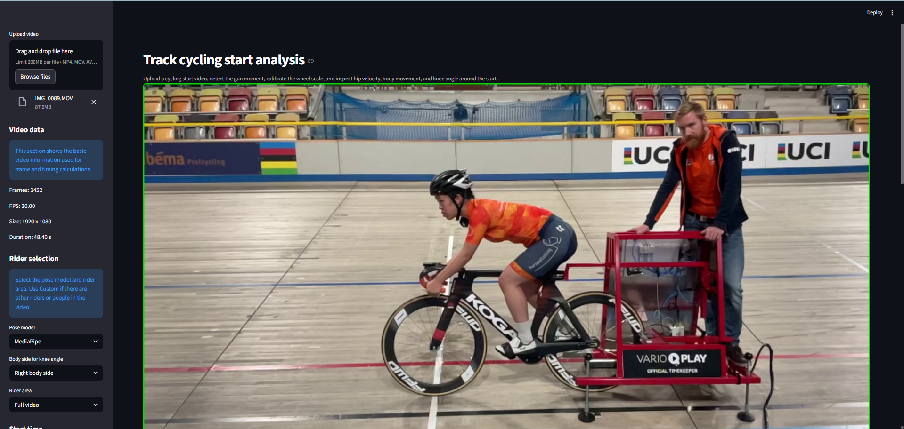
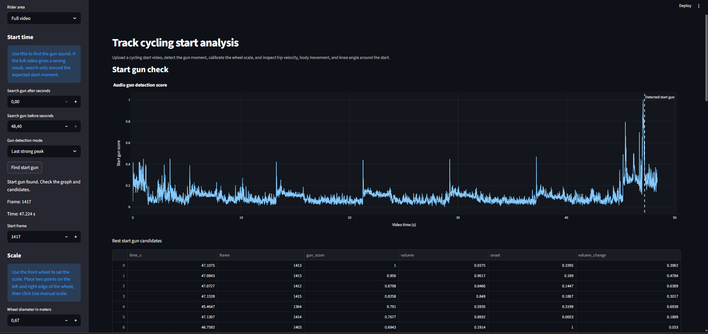
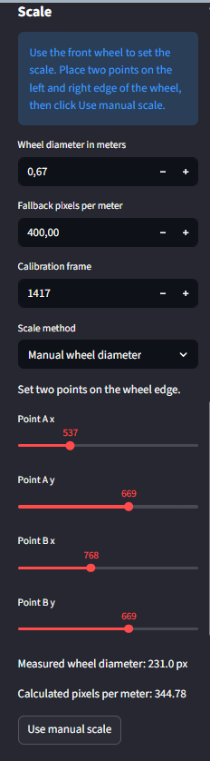
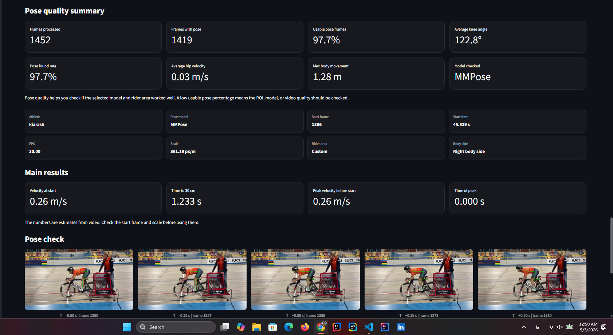
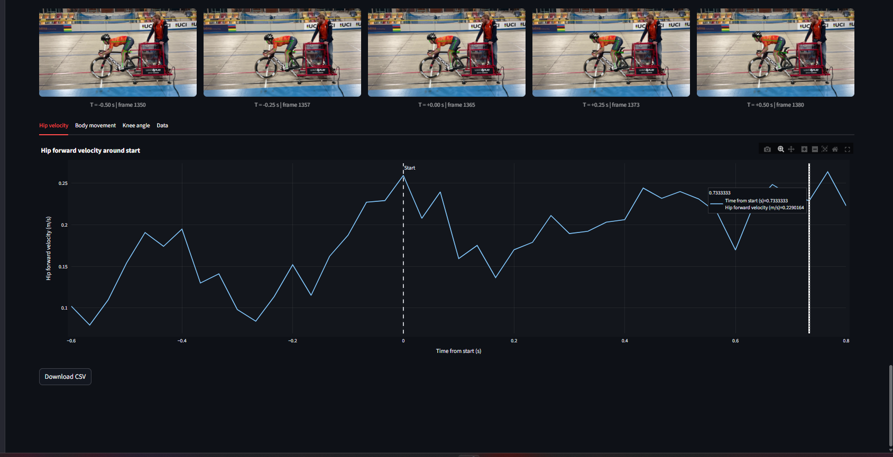
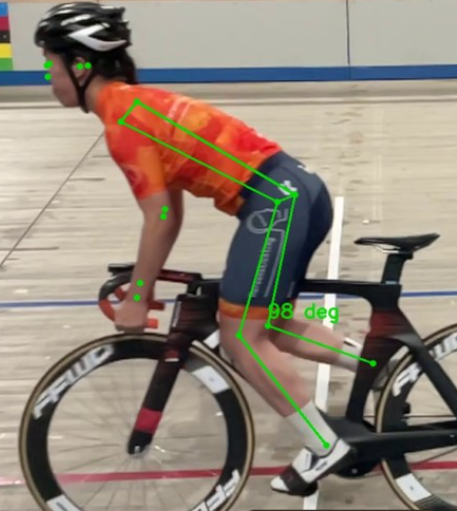

# Cyclist Start Analysis App

This project is part of a collaboration between **Ambient Intelligence** and the **Dutch Olympic Committee (NOC*NSF)**.

The goal is to support track cycling start analysis by using video and audio data. The app helps inspect the start moment, rider movement, knee angle, hip velocity, and body displacement around the start.

## Current MVP Features

- Upload a cycling start video
- Select the rider area using a full-video or custom region of interest
- Show pose quality summary to compare model reliability
- Detect the start gun from the video audio
- Show the detected start moment as frame and timestamp
- Preview key frames around the start moment
- Track cyclist pose using MediaPipe or MMPose
- Calculate knee angle during the start phase
- Estimate hip velocity and body forward movement
- Calibrate scale using the bicycle wheel diameter
- Detect a possible start gate / timing machine as a visual helper
- Add athlete name and timestamp to the exported data
- Export the analysis results as a CSV file

## Main Analysis Outputs

The app currently generates:

- Start frame and start time
- Knee angle over time
- Hip forward velocity
- Body forward movement
- Time to 30 cm movement
- Peak velocity before start
- Pose preview frames around the start
- CSV data with athlete name, timestamp, model, FPS, and scale

## Tech Stack

- Python
- Streamlit
- OpenCV
- MediaPipe
- MMPose
- Librosa
- Plotly
- Pandas / NumPy

## Model Choice

The app supports two pose models:

- **MediaPipe**: faster and useful for quick testing.
- **MMPose**: slower, but usually gives better pose quality and is preferred for more accurate analysis.

The app also shows a **pose quality summary** after running the analysis. This helps check whether the selected model and rider area worked well for the video.

For this MVP, both models can be tested, but MMPose is the better option when accuracy is more important than speed.

## MVP Screenshots

### App overview

The app shows the main workflow with video upload, rider selection, start setup, scale setup, and analysis controls.

### Start gun detection

The start gun is detected from the video audio and converted into a start frame and timestamp.

### Wheel scale calibration

The front wheel can be used to estimate pixels per meter for movement and velocity calculations.

### Analysis summary

After running the analysis, the app shows pose quality, setup details, main results, and key preview frames.

### Hip velocity graph

The hip velocity graph shows estimated forward hip velocity around the detected start moment.

### MMPose pose tracking

MMPose can be used to track the rider body points and calculate knee angle during the start phase.

## How to Use

1. Upload a cycling start video.
2. Select the pose model.
3. Select the rider area.
4. Detect the start gun from audio.
5. Calibrate the scale using the front wheel.
6. Optionally check the start gate detector.
7. Add the athlete name.
8. Run the analysis.
9. Review the graphs and download the CSV file.

## Current Limitations

This is still an MVP. The results should be checked visually before being used for coaching or research decisions.

Known limitations:

- Pose tracking can be less accurate when the rider is partly hidden.
- Velocity and distance depend on correct scale calibration.
- Camera angle and depth can influence position-based measurements.
- Start gate detection is a helper tool, not a final measurement tool.
- MediaPipe is fast, but MMPose may be preferred for better accuracy in later stages.

## Future Improvements

Possible next steps:

- Improve MMPose integration and accuracy
- Add angular velocity for knee and hip movement
- Add better filtering/smoothing for velocity graphs
- Improve start gun detection for noisy videos
- Add better automatic wheel and gate detection
- Compare multiple athletes or multiple starts
- Add report export for coaches
- Add validation against reference systems such as XSens

## Project Status

The current version is a working MVP for testing the full workflow:

**video upload → start gun detection → scale calibration → pose analysis → graphs → CSV export**